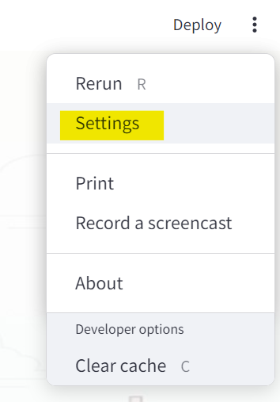
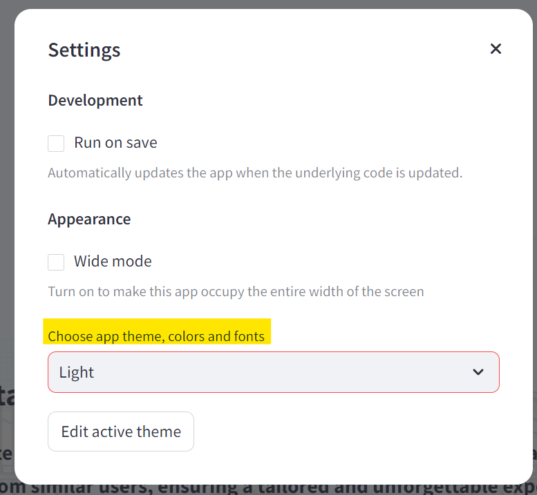

# AI Explorere NYC

Utilizing AI algorithms to craft personalized itineraries, considering diverse preferences and budgetary constraints for an enhanced travel experience


## Installation Using Conda

To install the project using conda, first navigate to the path where you want to save the files (make sure to change 'your/path' to the real path)
```bash
  cd your/path
```

Then, clone the GitHub repository:
```bash
  git clone https://github.com/LianFi15/AI-Explorer-NYC.git
```
Next, nevigate to the cloned directory: 
(make sure to change 'your/path' to the real path)
```bash
  cd your/path/AI-Explorer-NYC
```

Next, create a conda environment and install the dependencies(this part may take a few minutes):
```bash
  conda create --name NYC-Explorer-env --file spec-file.txt
```
Then, activate the conda environment:
```bash
  conda activate NYC-Explorer-env
```
Next, make sure streamlit is installed in your conda environment:
```bash
  conda install streamlit
```

At last, run the streamlit app and enjoy!
```bash
  streamlit run main.py
```
### Setting Up Streamlit App Theme and Colors
Once the Streamlit app is running, ensure that the 'app theme, colors and fonts' option is set to light. Otherwise, the buttons and font may not be visible.

Here's how to do it:

First, select the settings by clicking on the three dots in the top right corner of the Streamlit app.



Next, choose the "app theme, colors and fonts" and set it to white. 

